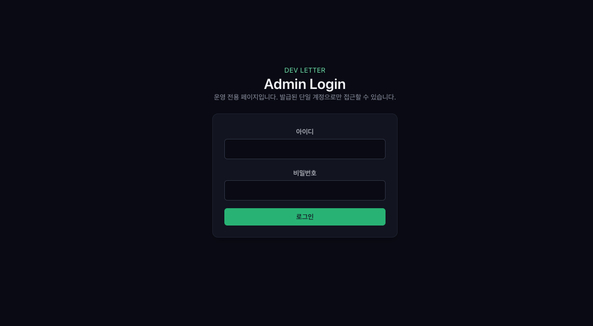
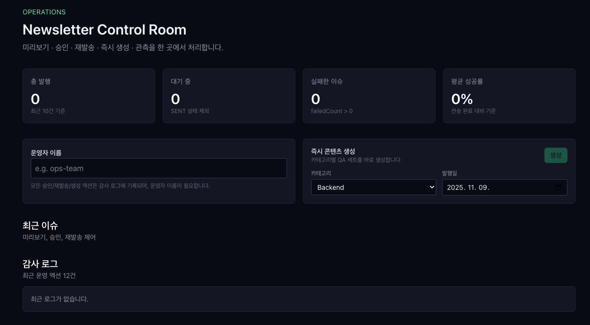

# Phase 5 — 관리자 도구 & 관측성

Phase 5에서는 **운영자가 매일 발행되는 이슈를 직접 감시하고 제어**할 수 있는 도구를 구축했다. 핵심 범위는 관리자 대시보드, 메트릭 수집, 감사 로그, 실패 알림까지 포함한다.

## 1. 관리자 대시보드 (/admin)

- `.env` 지정된 관리자 id, pw로 로그인을 할 수 있다.

- Next.js 라우트 `src/app/admin/page.tsx`가 서버에서 최신 이슈/감사 로그를 불러오고, 클라이언트 컴포넌트(`AdminDashboardClient`)에서 UI를 그린다.
- `/admin/login` 페이지에서 단일 관리자 계정(환경 변수 기반)을 입력하면 `admin-auth` 쿠키가 발급되고, 미들웨어가 해당 쿠키를 검증해 `/admin` 접근을 허용한다.
- 운영자는 “운영자 이름”을 입력해야 승인/재발송/즉시 생성 버튼이 활성화된다. 이름은 감사 로그에 남는다(로컬 스토리지 저장).
- 대시보드 기능
  - **요약 카드**: 총 발행 수, 대기 중 이슈, 실패 이슈, 평균 성공률을 노출.
  - **즉시 생성 폼**: 카테고리·발행일을 선택하고 `generateIssueAction` 서버 액션을 호출해 새로운 QA 콘텐츠를 바로 생성.
  - **이슈 카드**: QA 미리보기, delivery/metrics 수치, 상태, 발송 시간, 승인·재발송 버튼 제공.
  - **감사 로그**: 최근 12건의 운영 액션을 JSON 메타데이터와 함께 보여 준다.

## 2. 서버 액션 & 서비스 계층

- `src/services/admin-dashboard.ts`에 관리자 전용 서비스가 추가되었다.
  - `fetchAdminDashboardData`: 최신 이슈 + `IssueMetric` + `AdminActionLog`를 조합해 UI에서 바로 사용할 수 있는 구조체로 반환.
  - `approveIssue`: 발행 승인 시 `ensureDeliveriesForIssue`를 호출해 대상 구독자 큐를 생성하고, 결과를 감사 로그에 남긴다.
  - `resendIssue`: `sendNewsletterIssue`를 재사용해 기존 이슈를 다시 발송하고 성공/실패 통계를 기록.
  - `generateIssue`: 특정 카테고리/일자에 대해 AI 생성 파이프라인을 실행하고 이력을 기록.
- 각 액션은 `/admin/actions.ts`의 서버 액션으로 래핑되며, 수행 후 `/admin` 경로를 revalidate해 최신 데이터를 즉시 반영한다.

## 3. 메트릭 수집 (`IssueMetric`)

- Prisma 스키마에 `IssueMetric` 모델을 추가하고 `NewsletterIssue`와 1:1 관계를 맺었다.
- `src/services/issue-metrics.ts`의 `recordIssueMetrics`는 `IssueDelivery`를 상태별로 groupBy 하여 `sentCount`, `failedCount`, `pendingCount`, `successRate`를 계산·업서트한다.
- `sendNewsletterIssue`가 모든 배치를 마친 뒤 `recordIssueMetrics`를 호출하므로, 대시보드에서는 추가 쿼리 없이 최신 성과 지표를 확인할 수 있다.

## 4. 감사 로그 (`AdminActionLog`)

- `AdminActionLog` 모델은 `issueId`, `actor`, `action`, `metadata`(JSONB)를 저장하며, 모든 관리자 액션이 여기로 집계된다.
- 승인/재발송/즉시 생성 서비스는 `logAdminAction`을 통해 결과 요약(발송 통계, 생성 소스 등)을 JSON으로 남긴다.
- 감사 로그는 대시보드뿐 아니라 추후 외부 감사 또는 Slack 통지에도 활용 가능하다.

## 5. 알림 파이프라인

- `src/lib/alerts.ts`의 `publishAlert`는 Slack Webhook을 기반으로 메시지를 전송하며, 환경 변수가 비어 있으면 콘솔 로그로 대체한다.
- 발송 서비스(`sendNewsletterIssue`)는 ▲환경 변수 미설정으로 인한 `disabled` 상태 ▲실패 건수 발생 시 자동으로 Slack 경고를 보낸다.
- Cron Route(`src/app/api/cron/newsletter/route.ts`)는 잡 실패 시 `publishAlert`로 치명적 오류를 알린다.

## 6. 마이그레이션 & 환경 변수

- `prisma/migrations/20251201120000_phase5_admin_tools`에 `IssueMetric`/`AdminActionLog` 테이블과 인덱스를 정의했다.
- 운영 시 필요한 주요 환경 변수
  - `APP_BASE_URL`: CTA/수신 거부 링크 구성
  - `SLACK_WEBHOOK_URL`: 알림 전송
  - `CRON_SECRET`: `/api/cron/newsletter` 보호
  - `ADMIN_USERNAME`, `ADMIN_PASSWORD`: `/admin/login` 인증 및 미들웨어 쿠키 검증
  - `VERCEL_PROTECTION_BYPASS` 또는 별도 보호 수단(운영 환경에서 `/admin` 접근 제한 권장)

Phase 5 완료로 운영자는 `/admin` 페이지에서 콘텐츠 생성·큐 생성·발송 재시도를 직접 제어하고, Slack 알림과 메트릭을 통해 즉시 이상 징후를 발견할 수 있다. 이제 Phase 6에서 테스트/문서화/롤아웃을 마무리하면 실제 서비스 운영 준비가 끝난다.
